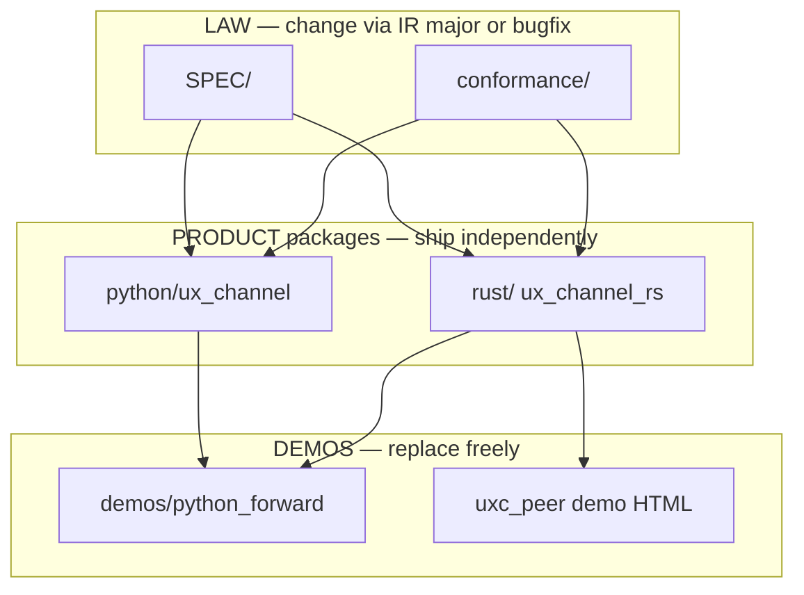

# Architecture — production layout for the long run

**Decision:** keep **Python + Rust in one monorepo**, with **hard package boundaries** and a **shared law layer**.  
Do **not** split into multiple repos until release volume forces it — protocol drift is worse than a larger tree.

---

## Why monorepo (stability)

| Concern | Multi-repo risk | Monorepo mitigation |
|---------|-----------------|---------------------|
| IR / cap / CXB drift | Spec updates land in one language first | `SPEC/` + `conformance/` are shared law; both impls must pass `./verify.sh` |
| Golden vectors | Copy-paste rot | One `conformance/` tree |
| Cap oracle / args_hash | Silent interop breaks | Same vectors + `uxc_check` + Python harnesses |
| Onboarding | “Where is truth?” | One README → ARCHITECTURE → TERMINOLOGY |

**Independent product releases still exist:**

| Artifact | Path | Release channel (target) |
|----------|------|---------------------------|
| Python host library | `python/` | PyPI (`ux-channel`) |
| Rust peer crate | `rust/` | crates.io (`ux_channel_rs`) |
| Law + vectors | `SPEC/` + `conformance/` | Versioned with IR major (`v: "1"`) |

Crate/package versions may differ; **IR major must match**.

---

## Layout (production)

```text
repo root
├── SPEC/                 LAW — normative drafts (IR, cap, invariants)
├── conformance/          LAW — golden JSON + CXB blobs + harnesses
├── python/               PRODUCT — full host library (ASGI, wire, caps, …)
│   └── ux_channel/
├── rust/                 PRODUCT — second peer (types, wire, cap, CXB, HTTP bins)
│   └── src/ + bins uxc_peer, uxc_check
├── demos/                MOVING — examples only, not production deps
│   └── python_forward/   thin Intent POST to Rust peer
├── docs guides           HOW_IT_WORKS, TERMINOLOGY, REFERENCE, FAQ, …
├── verify.sh             one-command green for both products + law
└── startup-peer.sh       local demo helper (oracle allow-listed)
```



---

## Rules that keep this mature

1. **Law first.** If Python and Rust disagree, vectors win; fix the bug or cut a major.  
2. **No business logic in demos.** `demos/python_forward` must not grow into a second host.  
3. **Peer gate is permanent; actions/HTTP chrome are moving** (see STRUCTURE.md).  
4. **Secrets fail closed** in any production binary (OPERATIONAL.md).  
5. **JSON floor forever for IR 0.1**; CXB is opt-in upgrade.  
6. **CI gate:** `./verify.sh` before merge; `./verify.sh --http` before release candidates.  
7. **Do not nest a production crate under `peers/`** — that name signals “optional experiment.” First-class `rust/` + `python/` signal ship-ready packages.

---

## When to split repos later

Split **only if** all of the following hold:

- Separate teams own Python vs Rust release trains  
- Cross-repo IR drift is controlled by a published conformance package  
- CI can still block merge on foreign-language vectors  

Until then, monorepo + clear roots is the lower-risk production default.

---

## Commands

Prefer Make (CI uses the same):

```bash
make verify
make verify-http
```

```bash
./verify.sh              # law + rust unit/check
./verify.sh --http       # + live rust peer + demo forward

# Python host on path
export PYTHONPATH="$PWD/python${PYTHONPATH:+:$PYTHONPATH}"

# Rust peer (production secret)
export UXC_CAP_SECRET='…'
cargo run --manifest-path rust/Cargo.toml --bin uxc_peer
```

See [STRUCTURE.md](STRUCTURE.md), [OPERATIONAL.md](OPERATIONAL.md), [python/README.md](python/README.md), [rust/README.md](rust/README.md).
