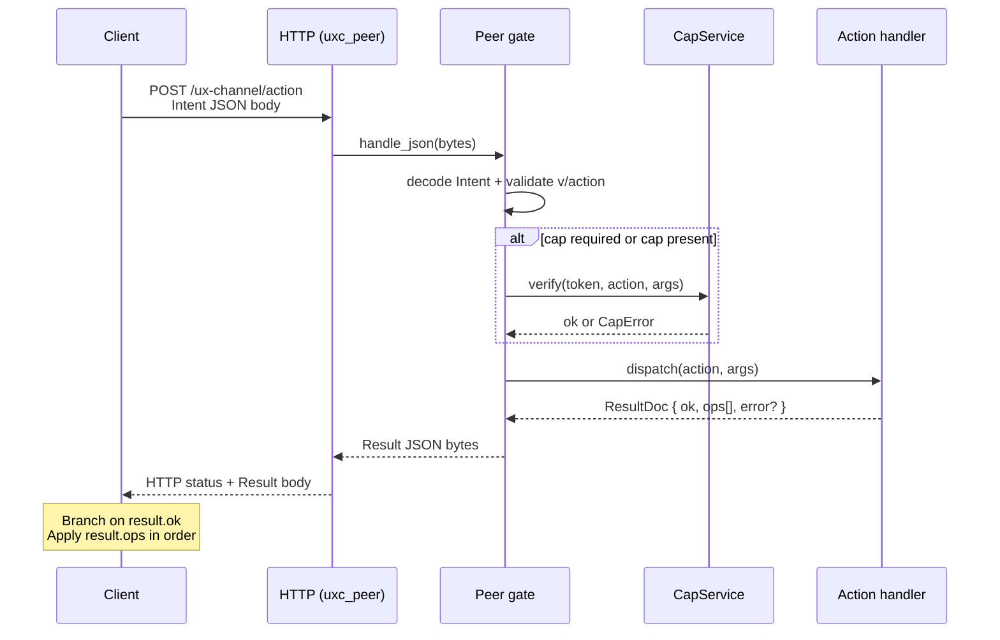
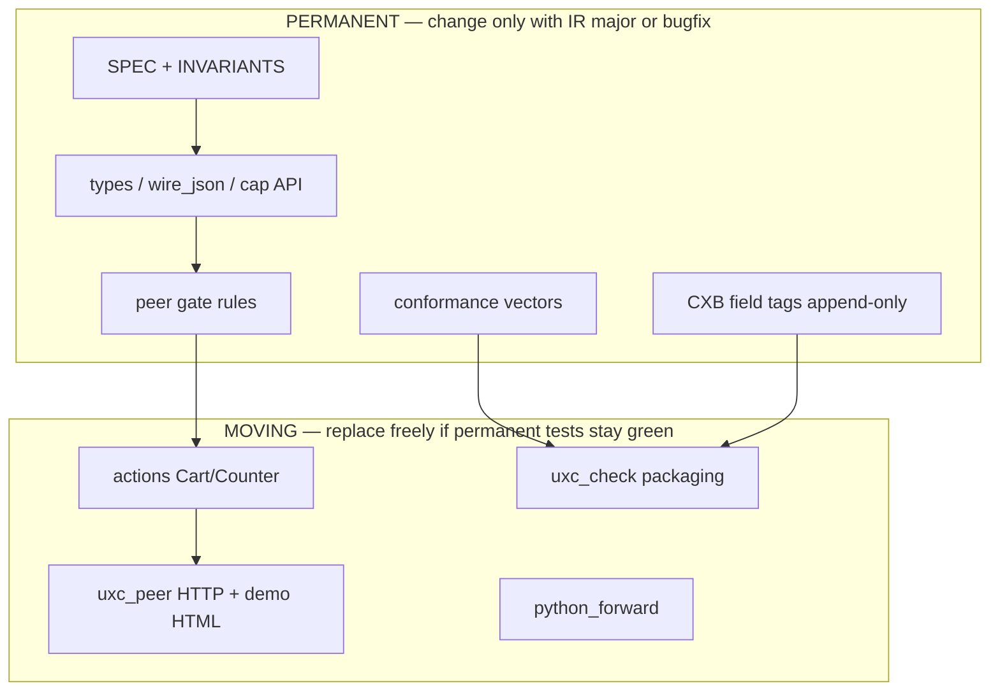
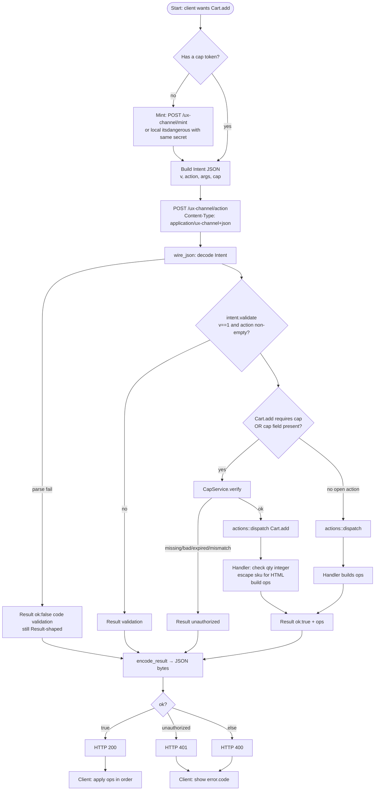
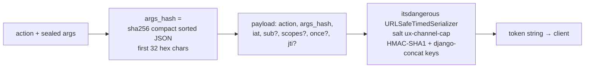
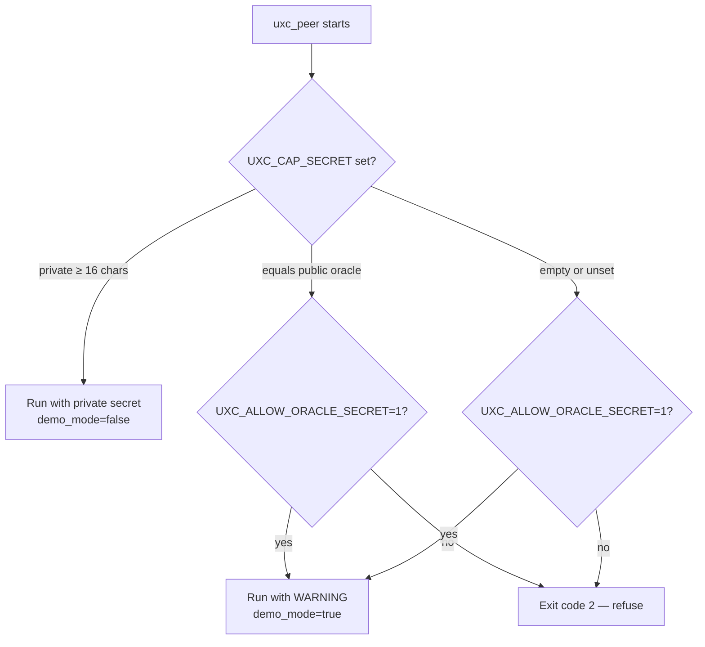
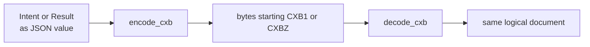
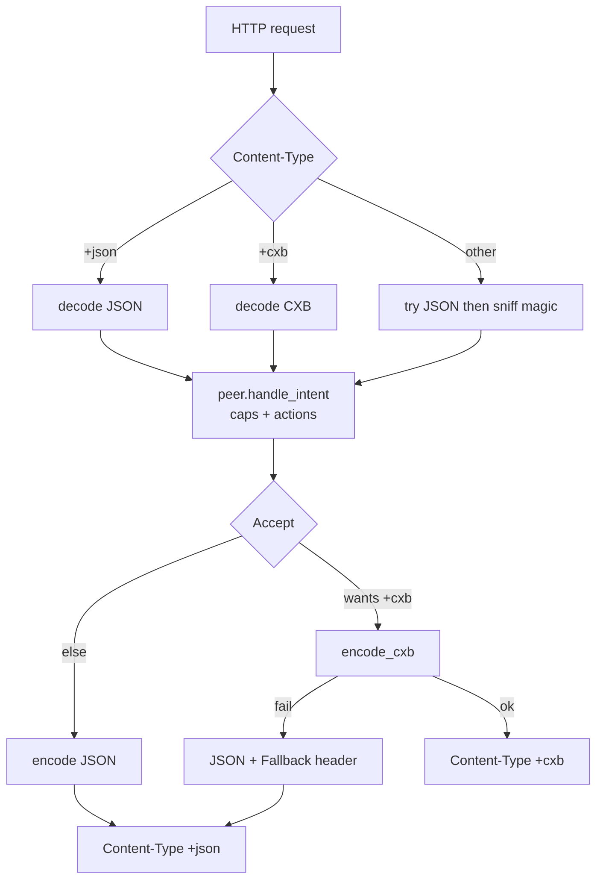

# How ux-channel works — human walkthrough

Read [START_HERE.md](START_HERE.md) first if you are new. This is Layer 2 (encyclopedia), not the intro.

**Audience:** anyone who is *not* expected to already know this codebase.  
**Goal:** after this document you can answer: *what happens, where, why, in what order, until when, and what you get at the end.*

Related shorter docs:

| Doc | When you need it |
|-----|------------------|
| [TERMINOLOGY.md](TERMINOLOGY.md) | **Glossary** — what each word is / does / is not |
| [REFERENCE.md](REFERENCE.md) | HTTP API, curl recipes, module map |
| [FAQ.md](FAQ.md) | Short Q&A |
| [README.md](README.md) | Status table + how to run checks |
| [OPERATIONAL.md](OPERATIONAL.md) | Secrets, env vars, production checklist |
| [STRUCTURE.md](STRUCTURE.md) | What is “law” vs what is “demo” |
| [SPEC/](SPEC/) | Normative field rules (law) |
| This file | Full story with diagrams and algorithms |

---

## 1. What this product is (one picture)

**ux-channel** is a contract so different programs can talk the same way:

```text
  Client (browser, Python, another service)
           │
           │  1. sends an Intent  ("please do Cart.add with these args")
           ▼
     Peer (here: the Rust binary uxc_peer)
           │
           │  2. checks authority (capability token)
           │  3. runs the action
           │  4. returns a Result  ("ok + list of effects, or error")
           ▼
  Client applies ops (show toast, patch HTML, set a signal, …)
```

There is **no** special “only Python can do this” RPC.  
There is **one IR** (Intermediate Representation): **Intent → Result + ops**.

| Word | Plain meaning |
|------|----------------|
| **IR** | The shared message shapes (`Intent`, `Result`, `Op`) everyone must understand |
| **Peer** | Any process that can accept an Intent and return a Result |
| **Action** | Named thing to do, e.g. `Cart.add`, `Counter.inc` |
| **Ops** | Ordered side-effects the client should apply (`toast`, `morph`, `signal_set`, …) |
| **Cap** | Signed **capability token** — portable permission for one action + sealed args |
| **JSON floor** | Everyone always works over JSON text first; binary is optional upgrade |
| **CXB** | Optional dense binary encoding of the same Intent/Result documents |
| **Oracle secret** | Public test secret in the repo — **never** production |

**Full glossary** (every term above and dozens more — media types, health fields, confusable pairs): [TERMINOLOGY.md](TERMINOLOGY.md).

---

## 2. The only loop that matters

Every successful call is this, nothing more exotic:



**Final result the human cares about:**

- **Success:** `ok: true` and an ordered `ops[]` list the UI can apply.  
- **Failure:** `ok: false` and `error.code` / `error.message` (still a Result document — not a random HTML error page).

HTTP status is **secondary** (helpers for proxies):

| Result | HTTP status (today) |
|--------|---------------------|
| `ok: true` | `200` |
| `error.code == unauthorized` | `401` |
| other Result errors | `400` |
| encode catastrophe | `500` |

Clients should still branch on **`ok` / `error.code`**, not only on status.

---

## 3. Vocabulary with examples

### 3.1 Intent (request)

“Please run this action under this permission.”

```json
{
  "v": "1",
  "action": "Cart.add",
  "args": { "sku": "abc-123", "qty": 2 },
  "cap": "<signed-token-string>",
  "request_id": "optional-client-id"
}
```

| Field | Required? | Why it exists |
|-------|-----------|---------------|
| `v` | yes | Protocol major; must be `"1"` today |
| `action` | yes | Which handler to call |
| `args` | no | Inputs; the **sealed** subset is hashed into the cap |
| `cap` | when policy says so | Authority; without it, protected actions fail closed |
| `request_id` | no | Echoed in `meta` for debugging |

### 3.2 Result (response)

“Here is success/failure and the effects to apply.”

```json
{
  "ok": true,
  "ops": [
    { "op": "toast", "message": "Added 2 x abc-123", "level": "success" },
    { "op": "morph", "target": "#cart", "html": "<div ...>...</div>" },
    { "op": "signal_set", "name": "cart.last_sku", "value": "abc-123" }
  ],
  "meta": { "action": "Cart.add", "peer": "ux_channel_rs", "runtime": "ux_channel_rs" }
}
```

Failure shape:

```json
{
  "ok": false,
  "ops": [],
  "error": {
    "code": "unauthorized",
    "message": "capability token required",
    "retryable": false
  },
  "meta": { "action": "Cart.add", "runtime": "ux_channel_rs" }
}
```

### 3.3 Ops (effects)

Each op is a flat object with `"op": "<type>"` plus fields.

| `op` | What the client is asked to do | Demo notes |
|------|--------------------------------|------------|
| `toast` | Show a short message | Display text is HTML-escaped |
| `morph` | Patch DOM at `target` with `html` | HTML is escaped for free-form args |
| `signal_set` | Store `name = value` on the client | **Raw** semantic value (not escaped) |
| `navigate` / `noop` / … | See SPEC | Not all used by the demo |

**Why escape morph/toast but not signal?**  
Morph/toast may be rendered as HTML. Signals are data for code. Mixing those rules would either break data or create XSS.

### 3.4 Cap (capability)

A **server-minted signed token** that means:

> “Whoever holds this may call **this action** with **exactly these sealed args** until it expires.”

It is **not** “trust whoever is on the TCP connection.”

---

## 4. Where things live (map of the tree)

```text
repo root
├── ARCHITECTURE.md                  ← monorepo production layout decision
├── HOW_IT_WORKS.md / TERMINOLOGY.md / REFERENCE.md / FAQ.md
├── OPERATIONAL.md / STRUCTURE.md
├── SPEC/                            ← LAW (IR, cap, invariants)
├── conformance/                     ← LAW (golden vectors + harnesses)
├── python/                          ← PRODUCT: full host library
│   ├── ONTOLOGY.md                  ← regions/bridges/state map (read first)
│   ├── ux_channel/                  ← wire, caps, ASGI, CXB oracle, …
│   ├── ux_dom/
│   └── docs/core/                   ← WIRE.md, CXB.md
├── rust/                            ← PRODUCT: host+peer kernel/runtime + classic gate
│   └── src/
│       ├── types.rs / wire_json.rs / cap.rs / cxb.rs / op_tags.rs
│       ├── peer.rs                  ← gate: validate → cap → dispatch
│       ├── actions.rs               ← demo handlers (moving)
│       └── bin/uxc_peer.rs + uxc_check.rs
└── demos/
    └── python_forward/              ← thin Python client → Rust (not the library)
```

### Permanent vs moving (why the split)



**Rule of thumb:** if deleting a file would break *another language’s* ability to interop, it is permanent. If it is only our demo cart UI, it is moving.

---

## 5. End-to-end: one Cart.add, step by step

This is the **order of operations** for a protected action.  
Nothing is reordered; each step either continues or returns a Result error.



### Step table (same path, prose)

| # | Where (file) | What happens | Why | Until when | Output |
|---|--------------|--------------|-----|------------|--------|
| 1 | Client / `python_forward` | Mint a cap for `(action, args)` | Authority must be sealed before the action | Token expires (`max_age`, default 3600s) | Opaque `cap` string |
| 2 | Client | Build Intent document | One IR for all peers | IR major stays `"1"` | JSON object |
| 3 | `uxc_peer` | Accept HTTP POST body | Transport only delivers bytes | Connection ends | Raw bytes |
| 4 | `wire_json` | Parse JSON → `Intent` | Floor encoding | Always | Struct or wire error |
| 5 | `types::Intent::validate` | Check `v` and `action` | Reject unknown IR early | — | ok or validation Result |
| 6 | `peer` gate | If action is cap-required **or** any `cap` is present → verify | Never silently ignore a present token | Cap 0.1 rules | continue or `unauthorized` |
| 7 | `cap::CapService` | Check signature, age, action match, args hash | Bind permission to exact sealed args | Token lifetime | ok or CapError |
| 8 | `actions::dispatch` | Run demo domain logic | Produce ops | Handler returns | `ResultDoc` |
| 9 | `wire_json` | Encode Result | Client must parse one shape | — | JSON bytes |
| 10 | `uxc_peer` | Map `ok`/`error.code` → HTTP status | Proxies / curl convenience | — | HTTP response |
| 11 | Client | If `ok`, apply each op | UI updates | Ops applied in order | Visible UI / signals |

**What you get at the end of a good Cart.add:** toast + morph HTML + `signal_set` for last sku, with free-form sku escaped in display fields.

---

## 6. Capability algorithm (mint and verify)

### 6.1 Mint (create permission)



| Input | Meaning |
|-------|---------|
| `action` | Only this action name will verify |
| `args` | Sealed args; **hash** is stored, not the full args blob |
| `sub` / `scopes` | Optional principal / scopes |
| `once` / `jti` | SPEC: single-use; **Rust Cap 0.1 does not consume jti yet** |

### 6.2 Verify (gate before handler)

```text
1. Token present and non-empty?     else → unauthorized (missing)
2. Signature valid under secret
   (or previous secret window)?     else → unauthorized (invalid)
3. Not expired (iat + max_age)?     else → unauthorized (expired)
4. payload.action == Intent.action? else → unauthorized (mismatch)
5. payload.args_hash == hash(args)? else → unauthorized (args mismatch)
6. sub / scopes checks if used      else → unauthorized
7. once/jti not already used        enforced (Python + Rust)
8. Only then → run action handler
```

**Present-cap-must-verify:**  
If the client *sends* a `cap` field on an *open* action (e.g. `Counter.inc`), the peer **still verifies** it. A bogus token never “accidentally succeeds” by being ignored.

### 6.3 Secrets (who can mint)



| Situation | Result |
|-----------|--------|
| Production secret set | Server starts; only holders of that secret can mint valid caps |
| Oracle / missing without allow | **Refuses to start** (fail closed) |
| Allow flag for local demo | Starts; health shows `demo_mode: true` |

Full checklist: [OPERATIONAL.md](OPERATIONAL.md).

---

## 7. Demo actions (what the handlers actually do)

| Action | Cap? | Args | On success ops | On failure |
|--------|------|------|----------------|------------|
| `Cart.add` | **required** | `sku` string, `qty` integer ≥ 1 (default 1) | toast, morph `#cart`, signal_set last sku | validation / unauthorized |
| `Counter.inc` | open* | `by` integer (default 1) | signal_set counter, toast | validation |
| `Counter.get` | open* | none | signal_set counter | — |
| anything else | — | — | — | `not_found` |

\*Open unless a `cap` is present — then present-cap-must-verify applies.

**Integer rule:** JSON string `"2"` is **not** coerced to `2`. That is intentional (no silent type confusion).

---

## 8. Wire formats: JSON floor vs CXB

### 8.1 Two layers people often confuse

| Layer | Question it answers | Today on Rust HTTP |
|-------|---------------------|--------------------|
| **IR semantics** | What fields mean | Always Intent / Result |
| **Codec** | How those fields are bytes on the wire | **JSON only** on `/action` |
| **Library CXB** | Can we encode/decode CXB at all? | **Yes** in `cxb.rs` |
| **HTTP negotiation** | Can client *ask* for CXB via Accept? | **Not yet** |

Health makes that honest:

```json
{
  "formats": ["application/ux-channel+json"],
  "codecs": ["json", "cxb"],
  "http": {
    "action": {
      "accept_response": ["application/ux-channel+json"]
    }
  },
  "policy": {
    "present_cap_must_verify": true,
    "once_jti_enforced": true
  }
}
```

| Field | Meaning |
|-------|---------|
| `formats` | What this HTTP endpoint **actually serves today** |
| `codecs` | What the **library** can encode/decode (includes CXB offline) |
| `accept_response` | What you may put in `Accept` **today** and get back |
| `once_jti_enforced` | Whether single-use caps consume jti (**true**) |

### 8.2 What CXB is

**CXB** = Channel eXchange Binary.

- Same documents as JSON Intent/Result.  
- Dense tags for common fields + ops (append-only tag numbers).  
- Magic: `CXB1` plain or `CXBZ` zlib-compressed.  
- CRC trailer for corruption detection.  
- Media type: `application/ux-channel+cxb`.



**Conformance:** frozen blobs under `conformance/expected/cxb/` prove decode interop with the Python oracle. Re-encode is structural (map key order may differ; that is a known encode-identity gap, not a semantic break).

### 8.3 Codec negotiation — designed vs implemented

The **full Python package** already defines negotiation (see zip `docs/core/WIRE.md` + `wire/negotiate.py`).  
The **Rust HTTP peer** has not wired it yet.

#### Algorithm (target — for humans)

```text
REQUEST:
  look at Content-Type
    application/ux-channel+json  → decode JSON Intent
    application/ux-channel+cxb   → decode CXB Intent
    missing / weird              → try JSON; optional magic sniff CXB1/CXBZ
  then run the SAME peer gate + actions (format never skips caps)

RESPONSE:
  look at Accept (ordered, first supported wins)
    prefers +cxb and peer can encode → encode Result as CXB
    else                             → encode Result as JSON  (floor)
  if CXB encode fails                → fall back to JSON
                                       + header X-Channel-Wire-Fallback: 1

HEADERS OUT:
  Content-Type: media type actually used
  X-Channel-Wire: json | cxb
```

#### Diagram (target negotiation)



#### Status table

| Piece | Status | “Until when” |
|-------|--------|----------------|
| `encode_cxb` / `decode_cxb` library | **Done** | Stable tags; freeform encode identity still evolving |
| HTTP Accept / Content-Type negotiation | **Not on wire** | Until `uxc_peer` implements it + health advertises honestly |
| Health claims `+cxb` in `formats` | **Forbidden today** | Until negotiation is real (`uxc_check` fails if claimed early) |
| JSON floor | **Always** | Forever for IR 0.1 |

---

## 9. HTTP surface map (what each URL is for)

| Method | Path | Purpose | Body | Until |
|--------|------|---------|------|-------|
| `GET` | `/` | Interactive demo HTML | — | Moving demo |
| `GET` | `/ux-channel/health` | Capability advertisement | — | Always |
| `POST` | `/ux-channel/action` | **Main product path** Intent→Result | Intent | Always |
| `POST` | `/ux-channel/mint` | Dev mint cap with peer secret | `{action,args,…}` | Demo/dev; protect or disable in prod |
| `OPTIONS` | `*` | CORS preflight | — | Browser demos |

Default bind: host `0.0.0.0`, port `8787` (`UXC_HOST` / `UXC_PORT`).

---

## 10. Failure catalog (what you see and why)

| Symptom | `error.code` | Typical cause | Look at |
|---------|--------------|---------------|---------|
| Missing cap on Cart.add | `unauthorized` | Forgot mint | `peer` gate |
| Bogus cap on any action | `unauthorized` | Present-cap-must-verify | `cap` |
| Wrong args vs sealed | `unauthorized` | Changed args after mint | args_hash |
| `qty: "2"` string | `validation` | No silent coercion | `actions` |
| Unknown action | `not_found` | Typo / wrong peer | `actions::dispatch` |
| `v: "2"` | `validation` | Wrong IR major | `types` |
| Bad JSON body | `validation` | Wire parse | `wire_json` / `peer.wire_fail` |
| Peer won’t start | process exit 2 | Secret policy | `OPERATIONAL.md` |
| Expect CXB over HTTP | N/A | Not negotiated yet | §8 |

---

## 11. How we prove it still works

**One command** (from package root):

```bash
./verify.sh          # harnesses + cargo test + uxc_check
./verify.sh --http   # also live peer + python forward
```

Same steps expanded:

```text
1. python3 conformance/harness/validate_json_vectors.py
      → structural law of JSON samples

2. python3 conformance/harness/validate_cxb_expected.py
      → frozen CXB blobs still decode / CRC ok

3. cd rust && cargo test --lib
      → unit tests: cap, cxb, peer gate, actions escape/coercion

4. cargo run --bin uxc_check -- ../conformance
      → Rust loads vectors + oracle cap + CXB + edge cases

5. (optional live — verify.sh --http)
   startup-peer.sh / UXC_ALLOW_ORACLE_SECRET=1 uxc_peer
   uxc_check --http http://127.0.0.1:8787
   python_forward --mint-via-peer
```

**Green means:** same Intent/Result/cap story works in vectors, in Rust, and over HTTP JSON.

---

## 12. Known gaps (honest “not yet”)

| Gap | SPEC says | Code today | Safe claim |
|-----|-----------|------------|------------|
| once / jti single-use | Required when `once=true` | Fields may exist; **not consumed** | Do not claim single-use controls |
| HTTP CXB negotiation | Accept / Content-Type | Library only | Do not send Accept: +cxb expecting binary |
| Byte-identical CXB freeform encode | Nice for golden sha256 | Structural re-encode only | Decode interop is the bar |
| WASM / mesh | Roadmap | Not started | N/A |

These are tracked in README status + INVARIANTS + health `once_jti_enforced: true`.

---

## 13. Reading order if you are new

1. [TERMINOLOGY.md](TERMINOLOGY.md) — words first.  
2. **This file** (big picture + diagrams).  
3. [REFERENCE.md](REFERENCE.md) — HTTP + recipes.  
4. [FAQ.md](FAQ.md) — remaining confusions.  
5. [STRUCTURE.md](STRUCTURE.md) — what you may freely change.  
6. [OPERATIONAL.md](OPERATIONAL.md) — before running `uxc_peer`.  
7. [SPEC/intent-result-ops.md](SPEC/intent-result-ops.md) — field tables.  
8. [SPEC/capability.md](SPEC/capability.md) — cap rules.  
9. [SPEC/INVARIANTS.md](SPEC/INVARIANTS.md) — kill criteria.  
10. Code: `rust/src/peer.rs` (gate) · `rust/src/apply.rs` + `runtime.rs` (peer kernel/runtime) · `actions.rs` · `bin/uxc_peer.rs`.

---

## 14. One-sentence summary

**A client sends a signed Intent; the peer verifies the capability, runs an action, and returns a Result full of ordered ops — always as a Result document, JSON on the wire today, with CXB ready in the library until HTTP negotiation lands.**
