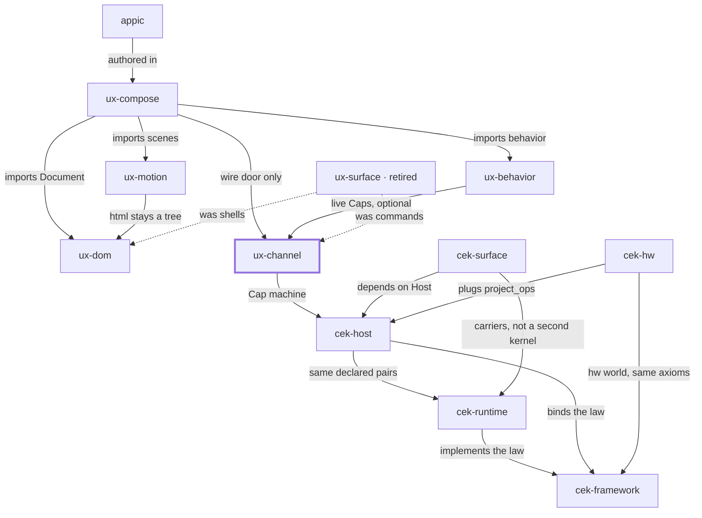

# Place in the stack

**You are here:** `ux-channel` in [bitplorer/ux-channel](https://github.com/bitplorer/ux-channel).

A click is not a form post. It is a signed Intent. Channel owns the wire. The default Cap machine is cek-host. cek=off is the explicit escape.

The picture is the same in every repo. The thick stroke is this library. A missing line is a missing door, not a forgotten one. Dashed lines are history.

## Owns

Intent, Result, the capability wire, peers, and the Cap-host adapter.

## Refuses

HTML, CSS, and the HTTP product host.

## Install

Import ux_channel. CLI uxchannel. Requires cek-host and cek-surface >= 0.2.0. Python 3.14 or newer.

## Doors

### Uses

- [cek-host](https://github.com/bitplorer/cek-python) — Cap machine

### Used by

- [ux-compose](https://github.com/bitplorer/ux-compose) — wire door only
- [ux-behavior](https://github.com/bitplorer/ux-behavior) — live Caps, optional
- [ux-surface](https://github.com/bitplorer/ux-surface) — was commands (history)

## The stack

## The walk

Mint, intent, verify, project, apply, undo.

1. **Mint.** Host mints a Cap. The subject on the Cap is the subject in the args. dev is the workshop. prod refuses the workshop secret.
2. **Intent.** **This library.** Channel carries action, args, and cap. That is the click. It is not a form post.
3. **Verify.** Host verifies the Cap before any shared-world write. A bad Cap, or a store that is down, refuses. ops is empty. The peer never mints.
4. **Project.** Only declared pairs leave the host. Baseline and ui.dom are the catalog. Hardware pairs arrive through project_ops. They are not a fork of Host.
5. **Apply.** The peer applies the ops. DOM is one world. GPIO is another. Surface carries the IR. It does not decide.
6. **Undo.** Lineage records the cause. End or revoke reverses it, or the op is marked non-reversible. A trace id never grants permission.

This library is step 2 of the walk.

## Notes

- Channel.boot is the Cap door.
- Redis wins when REDIS_URL is set. Otherwise one sqlite file.
- Do not pin cek-host before 0.2.0. Those wheels teach cek_host.legal.
