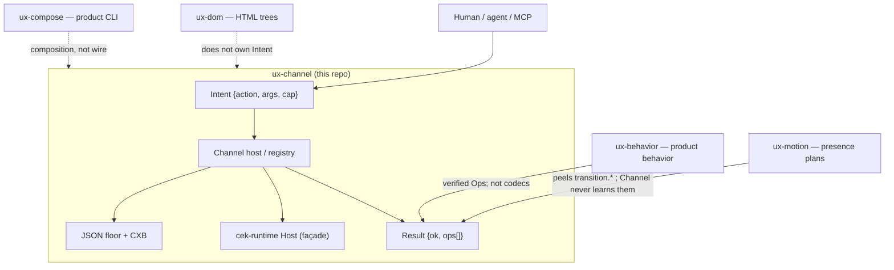
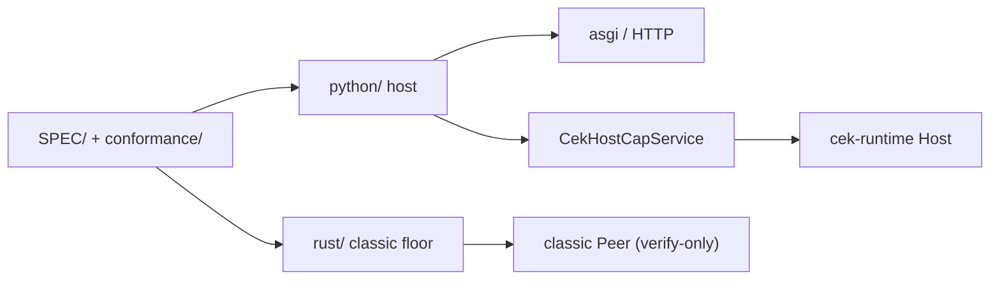

# C4-style overview — ux-channel

> **Diátaxis:** explanation · **Canonical:** `docs/internals/c4.md` · **Layer:** ux-channel
> Map: [../INDEX.md](../INDEX.md).

Grounded in [../../ARCHITECTURE.md](../../ARCHITECTURE.md). This layer owns
Intent / Result / Cap / wire / peers / Cap Host (cek-runtime; ≠ HTTP Product host). It does **not** own HTML trees or CSS.

Cap machine = **cek-runtime Host** + Channel façade (`CekHostCapService`).
There is no live `HostRuntime` / `PeerApply`.

## Context

## Containers (this repo)

Existing layout diagram: [../../ARCHITECTURE.md](../../ARCHITECTURE.md).
