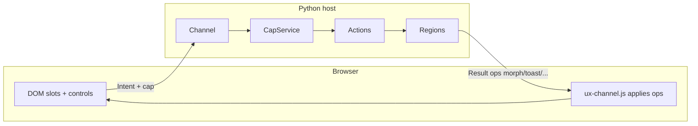

# Python host ontology — what exists, why, and which door to use

**Purpose of this file:** stop confusion about *regions*, *actions*, *ops*, *bridges*, *state*, etc.  
Read this **before** browsing the 180-module package.  
If two names sound similar, the table here decides which one you mean.

**Companion docs (extracted, deeper):**

| Doc | When |
|-----|------|
| [LAYOUT.md](LAYOUT.md) | **Cohesive packages** + legacy shims |
| [STRUCTURE.md](STRUCTURE.md) | Permanent vs moving |
| [docs/start/LAYERS.md](docs/start/LAYERS.md) | Import tiers |
| [docs/start/GOLDEN_PATH.md](docs/start/GOLDEN_PATH.md) | Application API walkthrough |
| [docs/start/API_SURFACE.md](docs/start/API_SURFACE.md) | What is frozen public |
| [docs/regions/REGIONS.md](docs/regions/REGIONS.md) | Region usage recipes |
| [docs/regions/REGIONS_FS.md](docs/regions/REGIONS_FS.md) | File-based region discovery |
| [docs/regions/COMPONENTS.md](docs/regions/COMPONENTS.md) | Optional ChannelComponents |
| [docs/core/WIRE.md](docs/core/WIRE.md) · [RESULT.md](docs/core/RESULT.md) | Wire IR (language-neutral) |
| Repo [TERMINOLOGY.md](../TERMINOLOGY.md) | Full glossary (IR + both languages) |

---

## 1. One sentence of intent

**The browser never invents business truth.**  
It sends a signed **Intent** (action + args + optional **cap**).  
The server runs an **action**, may re-paint **regions**, and returns a **Result** full of ordered **ops** the client applies.

Everything in `ux_channel` exists to serve that loop — or is optional product chrome around it.



---

## 2. Ontology (layers of being)

Think in **five strata**. Never mix them.

| # | Stratum | Is | Is not | User speech |
|---|---------|----|--------|-------------|
| **0** | **Wire IR** | `Intent`, `Result`, `ops[]`, error object | UI, HTML, React | “What crosses the network” |
| **1** | **Authority** | Caps, secrets, nonce/idempotency, CSRF helpers | Business rules | “Is this Intent allowed?” |
| **2** | **Action** | Named handler: mutates **truth/draft**, returns Result | A DOM node | “What happened?” |
| **3** | **Region** | Stable **DOM slot** the server can re-HTML | An npm widget | “What re-paints?” |
| **4** | **Host chrome** | ASGI mount, placement attrs, demo HTML | The protocol itself | “How it sits in my app” |

**Regions live in stratum 3.** They are not actions, not bridges, not wire codecs.

---

## 3. The “looks similar” decision table (read every row)

| You want… | Use this | Module / import | **Do not** use |
|-----------|----------|-----------------|----------------|
| Re-paint a **server-owned HTML fragment** after an action | **Region** | `from ux_channel import Region` · `@ch.region` · `ch.regions` | Bridge, ChannelComponent (unless you want a kit block) |
| Host a **Chart.js / Leaflet / npm island** | **Bridge** | `from ux_channel.bridges import …` | Region (regions return HTML strings; bridges return mount attrs + bridge ops) |
| Drop-in **server-driven UI kit** (Badge, Modal…) without ux-dom | **ChannelComponent** | `from ux_channel.components import …` | Calling it “Component” (clashes with ux-dom); not application API required |
| Mutate session / guard client paths | **state** | `from ux_channel import state` → `state(ch)` | `planes()` as application API (power helper only) |
| Agent tools / situation / effects | **agents** | `from ux_channel import agents` → `agents(ch)` | Dual agent APIs / raw MCP unless you need MCP plane |
| Low-level “patch this selector” without a region registry | **ops** | `from ux_channel.protocol.ops import morph, toast, …` | Hand-building ops when `ch.done(refresh=[…])` already does it |
| Multi-surface structure (HTML is one projection) | **morph_ir** | `from ux_channel.render.morph_ir import elem, region` | Treating morph_ir `region()` as an HTML tag |
| Framework-agnostic attrs/scripts for the page shell | **Placement** | `ux_channel.placement` | Putting markup ownership inside Channel |
| File/package auto-discovery of Region classes | **RegionDirectory** | `region_directory` / config `regions=` | Assuming core Intent plane needs it (it does **not**) |
| Scaffold region files from CLI | **region CLI** | `uxchannel region add …` | Confusing CLI with runtime |
| Encode Intent/Result bytes (JSON/CXB) | **wire** | `ux_channel.wire` | Cap crypto (that’s `capability`) |
| Sign/verify permission tokens | **CapService** | `ux_channel.capability` (`mint`/`verify`) | Rust name `mint` — same idea, different method names |
| Live in-process topic → refresh regions | **live** | `ux_channel.live` | Redis/SSE itself (that’s push bus / separate docs) |

If you are still unsure: **default to Region + Action + `ch.done(refresh=…)`**. Add bridges only when the browser must own a JS widget lifecycle.

---

## 4. Region ontology (precise)

> ### Names (do not confuse)
>
> | Name | One-line |
> |------|----------|
> | **region** (idea) | A stable paint slot on the page |
> | **`Region`** (type) | Class (or `@ch.region` fn) for **one** slot — **use this in apps** |
> | **`RegionBook`** (type) | Registry of all slots on the Channel (`ch.regions`) — **not** a rename of Region |
> | **`RegionDirectory`** | Optional FS discovery that fills the book |
>
> We did **not** rename Region → RegionBook. Both names always existed.


### 4.1 What a Region **is**

| Property | Meaning |
|----------|---------|
| **Identity** | Stable `uid` → DOM `data-channel-id="…"` |
| **Render** | Function/method → HTML string or SafeHtml for **that slot only** |
| **Refresh** | After an action, server re-runs render(s) and emits **morph** (or swap) ops |
| **Scope** | Per-paint ids (`order_id=…`) available as `ctx.scope` |

### 4.2 What a Region **is not**

| Not | Actual concept |
|-----|----------------|
| Whole page / SPA router | Your host templates / navigate ops |
| React/Vue component tree | Optional host; Channel returns HTML or morph IR |
| npm package host | **Bridge** |
| The action itself | **Action** mutates truth; region only paints |
| Wire codec | **wire** / CXB |
| Database | **state.db** is guards; you own durable stores |

### 4.3 Three authoring styles (same ontology, different syntax)

| Style | When | Entry |
|-------|------|-------|
| **Function** | Small apps, few slots | `@ch.region` + `@ch.on(refresh=[…])` |
| **Class `Region`** | Methods as actions, clear ownership | `class CartBadge(Region):` + `@Region.action` + `ch.use(CartBadge)` |
| **Filesystem** | Large workplace, many files | `RegionDirectory` / `ChannelConfig(regions=…)` / `uxchannel region add` |

All three register into the same **RegionBook** (`ch.regions`): uid → loader/render.

```text
@ch.region / Region.mount / RegionDirectory
            │
            ▼
     RegionBook (ch.regions)
            │  revalidate / refresh
            ▼
     morph ops → client DOM slots
```

### 4.4 Modules (so folder noise does not confuse)

| File | Ontological role | Application API? |
|------|------------------|--------|
| [`regions.py`](src/ux_channel/host/regions.py) | **RegionBook**, `@region` decorator, context, revalidate | Yes (via Channel) |
| [`region_component.py`](src/ux_channel/host/region_component.py) | Class-style **Region**, `@Region.action`, `ch.use` | Yes if you prefer classes |
| [`region_directory.py`](src/ux_channel/host/region_directory.py) | Opt-in FS/package discovery | No — shell feature |
| [`region_cli.py`](src/ux_channel/host/region_cli.py) | Scaffold files for discovery | No — DX only |
| [`morph_ir.py`](src/ux_channel/render/morph_ir.py) | IR node named `region` = morph **target**, same law | Power |
| [`ops.py`](src/ux_channel/protocol/ops.py) | `morph`/`swap` builders the refresh path emits | Power / implicit |
| [`live.py`](src/ux_channel/host/live.py) | Bind topics → region uids (in-process) | Power |
| [`components/*`](src/ux_channel/components/) | Optional kit built **on** regions | Optional |
| [`bridges/*`](src/ux_channel/bridges/) | **Not regions** — JS islands | Optional |

---

## 5. Action vs Region vs Op (order of being)

```text
1. User clicks control (attrs from ch.control / cap)
2. Intent { action, args, cap } hits peer
3. Capability verifies (stratum 1)
4. Action handler runs (stratum 2) — mutates draft/db
5. Refresh list → RegionBook re-renders (stratum 3)
6. Result { ok, ops: [morph…, toast…] } (stratum 0)
7. Client applies ops in order
```

| Concept | Verb | Owns |
|---------|------|------|
| **Action** | *does* | Truth change |
| **Region** | *shows* | HTML for a slot after truth change |
| **Op** | *instructs client* | Morph, toast, navigate, signal_set, … |
| **Cap** | *authorizes* | That this Intent may run with these sealed args |

**Confusion pattern:** putting business logic in `render()`.  
**Rule:** `render` is pure paint from current truth; mutations only in actions.

---

## 6. Application API golden path (only imports you need)

**Preferred** (narrow surface — fewer footguns):

```python
from ux_channel.host.api import Channel, ChannelConfig, Region, state, agents, attach_audit
```

**Also frozen** (same objects):

```python
from ux_channel import Channel, ChannelConfig, Region, state, agents, attach_audit
```

```python
ch = Channel.boot(app, config=ChannelConfig.development(secret="…"))
# app may be omitted for pure in-process use:
# ch = Channel.boot(secret="…")

@ch.region
def cart_badge(ctx):
    n = ch.draft.get("n", 0)
    return f'<span data-channel-id="cart_badge">Cart ({n})</span>'

@ch.on(refresh=[cart_badge])
def cart_add(product_id: str = "sku"):
    ch.draft.change("n", lambda n: (n or 0) + 1, default=0)
    return ch.done(notice=f"Added {product_id}")
```

Class form (same ontology):

```python
class CartBadge(Region):
    def render(self, ctx):
        n = self.ch.draft.get("n", 0)
        return f"<strong>{n}</strong>"

    @Region.action
    def add(self, product_id: str = "sku"):
        self.ch.draft.set("n", self.ch.draft.get("n", 0) + 1)

badge = ch.use(CartBadge)   # registers region + actions
```

**Stop here** until this is clear. Everything else is power tier.
Structure permanence: [STRUCTURE.md](STRUCTURE.md).


## 7. Import map by intent (not by alphabet)

```text
DAY-1 (prefer: from ux_channel.host.api import …)
  Channel, ChannelConfig     boot façade
  Region                     class-style slot
  RegionBook, RegionContext  via regions / Channel
  state, agents, attach_audit
  Intent, Result, ops helpers (morph, toast, …)
  CapError            when verifying fails

POWER (import by home package)
  ux_channel.wire            codecs + negotiate
  ux_channel.capability      sign/verify
  ux_channel.morph_ir        multi-surface IR
  ux_channel.bridges.*       npm islands
  ux_channel.components.*    optional kit
  ux_channel.asgi.*          HTTP surface
  ux_channel.quantity        measured money/stock
  ux_channel.workplace       rooms / mesh
  ux_channel.mcp             agent tool plane
  ux_channel.live            in-process live bind
  ux_channel.region_directory  FS discovery

INTERNAL (may move — do not teach as API)
  peer plumbing, host CSRF internals, demo HTML helpers
```

Alphabetized `ls ux_channel/` is **not** the product map. This section is.

---

## 8. RegionBook mental model

| Term | Meaning |
|------|---------|
| **uid** | Stable string id (`cart.badge`, `Cart:badge`, …) |
| **RegionDef** | Registered render/loader for a uid |
| **RegionContext** | Per-request subject + scope for paint |
| **refresh=[…]** | After action, which uids to re-paint |
| **revalidate** | Product speech: re-render selected regions → morph ops |
| **Unknown uid on refresh** | Skipped with warning (does not fail whole Result) |
| **Paint exception** | That region skipped; others still update |

---

## 9. Anti-patterns (user confusion sources)

| Anti-pattern | Why it confuses | Do instead |
|--------------|-----------------|------------|
| One module does action + chart npm + session | Mixes strata 2/3/4 | Split: action mutates; region paints; bridge mounts chart |
| Naming a Bridge method `region_*` | Implies morph slot | Use `mount_*` / bridge ops |
| Teaching `planes()` on application API | Power safety API | `state(ch)` only |
| Using region for a full page rewrite | Wrong grain | `navigate` / template page + small regions |
| Expecting regions to work multi-worker via `live` alone | live is in-process | Push bus / Redis for cross-worker |
| Hand-minting caps in the browser | Forgable | `ch.control` / server `sign` |
| Assuming Python `sign` ≠ Rust `mint` means different crypto | Naming only | Same itsdangerous + args_hash law |

---

## 10. How this relates to the monorepo (Rust)

| Python host | Shared law | Rust peer |
|-------------|------------|-----------|
| `CapService.mint/verify` | Cap 0.1 + args_hash | `CapService.mint/verify` |
| Regions + morph ops | Result `ops[]` | Demo actions emit morph/toast/signal_set |
| `wire` / CXB | conformance vectors | `cxb` + `wire_json` |
| Full ASGI product | IR `v: "1"` | Thin HTTP `uxc_peer` |

**Regions are a Python-host UX pattern.**  
Rust proves the **wire + cap** peer. It does not re-implement RegionBook.  
Interop is at Intent/Result/cap — not at `@ch.region`.

---

## 11. Checklist: “Am I using regions correctly?”

1. Does this UI piece have a **stable id** the server can target? → Region.  
2. Does an action **change truth**, then list that id in **refresh**? → Yes.  
3. Is `render` free of side effects? → Yes.  
4. Is this actually a JS widget lifecycle? → Bridge, not Region.  
5. Am I only exploring wire/cap interop? → Use `wire` + `capability` + conformance; skip regions.

---

## 12. Where code lives (quick index)

```text
python/
  ONTOLOGY.md                 ← you are here (concepts)
  LAYOUT.md                   ← every module → zone (anti-flat)
  STRUCTURE.md                ← permanent vs moving (host)
  ux_channel/catalog/           ← navigational packages
  README.md                   ← package entry + tests
  ux_channel/api.py          ← narrow application API imports
  docs/start/                 ← layers, golden path, API surface
  docs/regions/               ← region recipes + FS + components note
  docs/core/                  ← wire / CXB / errors (IR)
  ux_channel/
    regions.py                ← RegionBook (core)
    region_component.py       ← class Region
    region_directory.py       ← opt-in discovery
    region_cli.py             ← scaffolding
    ops.py · morph_ir.py      ← ops / multi-surface IR
    bridges/ · components/    ← optional, not core ontology
    capability.py · wire/     ← authority + codecs
    channel.py                     ← Channel façade (application API)
```

**Rule of thumb for newcomers:**  
**Channel + Region + Action + Result ops** is the whole product story.  
Everything else is a named door for a named intent — open it only when the decision table in §3 says so.
